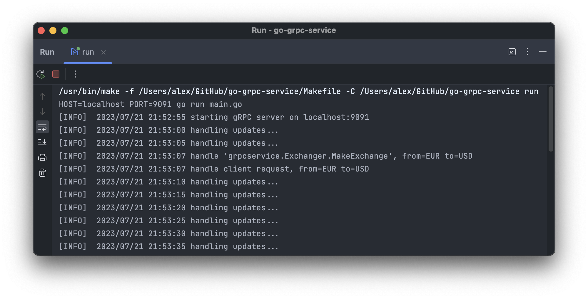

# go-grpc-service

### gRPC service handles external requests by using Protocol Buffer messages.

📌 Install gRPCurl client and Protobuf compiler before use:
```
brew install grpcurl protobuf
go install google.golang.org/protobuf/cmd/protoc-gen-go@latest
go install google.golang.org/grpc/cmd/protoc-gen-go-grpc@latest
```

💡 Template message (-msg-template) might be inserted into stream as is:
```
{
  "From": "EUR",
  "To": "USD"
}
```



🎥 Thanks [Nic Jackson](https://www.youtube.com/c/NicJackson) for sharing his knowledge.
